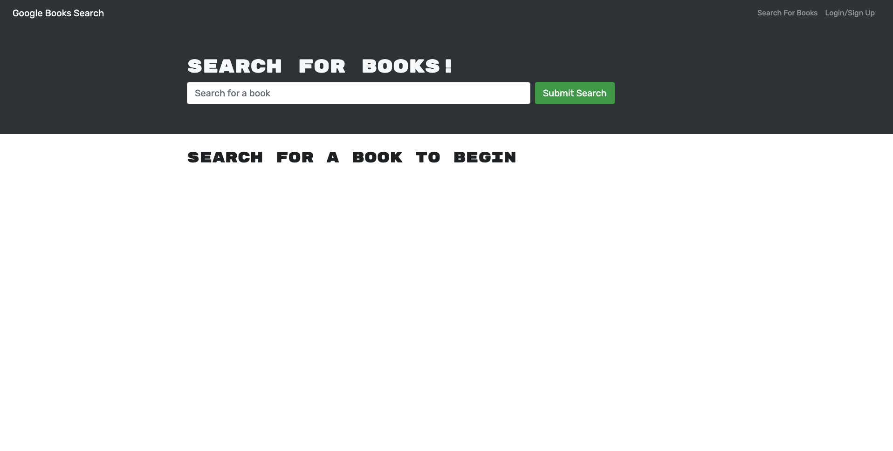

 
 # Book Search
 ## *Table of Contents*
1. [Description](#description)
2. [Usage Information](#usage-information)
3. [Installation Instructions](#installation-instructions)
4. [Questions](#questions)
5. [License Info](#license-info)

 _ _ _
 ## *Description*
 ### Week 21 Submission: MERN Challenge: Book Search Engine
  The task was to take a fully functioning Google Books API search engine build with RESTful API and refactor to be a GraphQL API built with Apollo Server.  The app was built using the MERN stack, with a React front end, MongoDB database, and Node.js/Express.js server and API.
 Completed the following challenge tasks -  

 - 1) Set up an Apollo Server to use GraphQL queries and mutations to fetch and modify data, replacing the existing RESTful API.
 - 2) Modified the existing authentication middleware to work in the context of a GraphQL API
 - 3) Created an Apollo Provider so requests can communicate with an Apollo Server
 - 4) Deployed the application to Heroku
   
  The app allows all users to search for books utilizing the Google Book Search API. The search returns books relevant to the search criteria. Each book includes its cover-art the Title, Author(s) and a description of the book.
  
  If the user is logged in, the book will include a "Save this Book!" button below the description, which the user may click to store that particular book in their personal profile. The stored books will persist for that user the next time they log on.
  
  If a user doesn't have an account, they may sign up for one by clicking the "Sign Up" button on the login in page. Once they have successfully created an account, they will be logged in.

 
 _ _ _
 ## *Usage Information*

- To run the app, after you've installed as per the instructions below, run 'npm run develop' from the command line.
- Login or sign up it you'd like to save books
- Enter your search criteria and click 'submmit search'

  - - -
 ## *Installation Instructions*
  To install the application:
  - 1) Downloading the files
  - 2) run 'npm run install' from the root directory
  - 3) run 'npm i concurrently' from the root directory  
  - - -
 
 
 ## *Questions*
 ###   For questions or comments concerning this project please contact, Patrick Lawler, the author, owner and manager the work via either github or email. Links for each are listed below.
 - GitHub - [pjlawler](https://github.com/pjlawler) 
 - eMail - patlaw777@icloud.com
 _ _ _
 ## *License Info*
    Copyright Ⓒ 2022 Patrick Lawler
      
    Permission is hereby granted, free of charge, to any person obtaining a copy of this software and associated documentation files (the "Software"), to deal in the Software without restriction, including without limitation the rights to use, copy, modify, merge, publish, distribute, sublicense, and/or sell copies of the Software, and to permit persons to whom the Software is furnished to do so, subject to the following conditions:
    
    The above copyright notice and this permission notice shall be included in all copies or substantial portions of the Software.
    
    THE SOFTWARE IS PROVIDED "AS IS", WITHOUT WARRANTY OF ANY KIND, EXPRESS OR IMPLIED, INCLUDING BUT NOT LIMITED TO THE WARRANTIES OF MERCHANTABILITY, FITNESS FOR A PARTICULAR PURPOSE AND NONINFRINGEMENT. IN NO EVENT SHALL THE AUTHORS OR COPYRIGHT HOLDERS BE LIABLE FOR ANY CLAIM, DAMAGES OR OTHER LIABILITY, WHETHER IN AN ACTION OF CONTRACT, TORT OR OTHERWISE, ARISING FROM, OUT OF OR IN CONNECTION WITH THE SOFTWARE OR THE USE OR OTHER DEALINGS IN THE SOFTWARE.